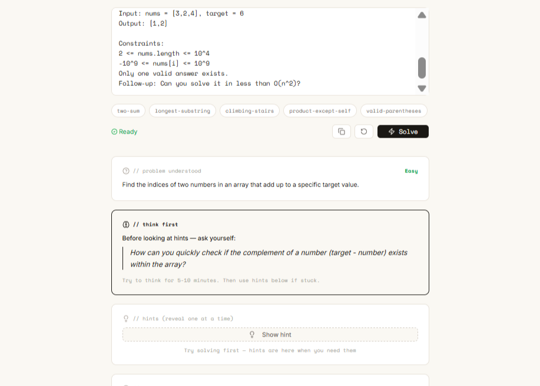
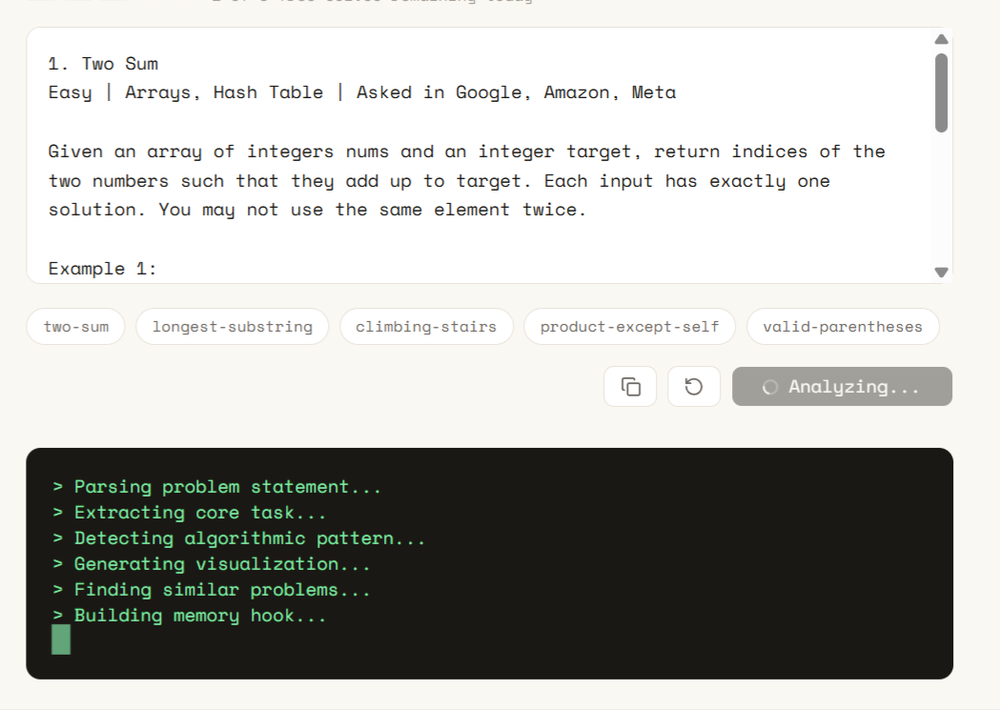
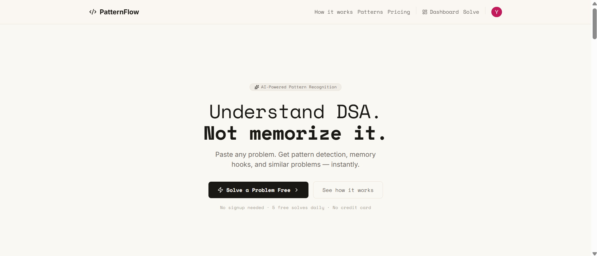

# 🚀 PatternFlow — AI-powered DSA Learning System

<p align="center">
  <b>Learn how top candidates think — not just solve.</b>
</p>

<p align="center">
  
</p>

> Stop memorizing solutions. Start recognizing patterns.

PatternFlow is an AI-powered platform that helps developers learn Data Structures & Algorithms through **pattern recognition**, not brute-force solution memorization.

---

## 🎯 What makes PatternFlow different?

- No instant solutions  
- Forces you to think first  
- Teaches patterns, not answers  
- Builds long-term intuition  
- Simulates real interview thinking  

**This is not a problem-solving tool.**  
**This is a thinking system.**

---

## 🧠 Problem

Most DSA platforms optimize for solving — not understanding.

- ❌ Solutions too early  
- ❌ Passive learning  
- ❌ No pattern abstraction  
- ❌ No personalized feedback  

**Result:** You can solve problems, but struggle in interviews.

---

## 💡 Solution

> Problem → Think → Hint → Pattern → Memory → Mastery

Instead of giving answers, PatternFlow:
- Trains thinking  
- Reveals patterns gradually  
- Builds intuition  

---

## ⚡ AI Solve Flow (Core Experience)

<p align="center">
  
</p>

---

## 📊 Dashboard Preview

<p align="center">
  
</p>

---

## ✨ Features

### 🧩 AI-Guided Solve Flow
- Paste problem (LeetCode, GFG, Codeforces supported)
- AI extracts:
  - Problem summary
  - Pattern detection
  - Difficulty
- Guided hints (step-by-step)

---

### 💰 Learning-first Monetization
Free users get:
- Think-first prompt
- 2 hints

Unlock:
- Final hint  
- Pattern reveal  
- Memory hook  
- Similar problems  
- Missing concepts  

---

### 🧠 Pattern Learning
- Pattern detection (Hash Map, DP, Sliding Window, etc.)
- Memory hooks for retention
- Interview spotting tips

---

### 📊 Progress Tracking
- Problems solved  
- Patterns seen  
- Pattern mastery  
- Streak tracking  
- Recent solves  

---

### ⚡ Performance Optimizations
- Rate limiting  
- Token usage tracking  
- Semantic caching (in progress)  

---

## 🏗️ Tech Stack

### Frontend
- Next.js (App Router)
- TypeScript
- Tailwind CSS

### Backend
- Next.js API Routes
- Supabase (PostgreSQL)
- Clerk Auth 

### AI
- OpenAI API

### Payments
- Razorpay

---

## ⚙️ Setup Instructions

### 1. Clone Repo

```bash
git clone https://github.com/your-username/patternflow.git
cd patternflow
```

---

### 2. Install Dependencies

```bash
npm install
```

---

### 3. Environment Variables

Create `.env.local`:

```env
# Supabase
NEXT_PUBLIC_SUPABASE_URL=
NEXT_PUBLIC_SUPABASE_ANON_KEY=

# OpenAI
OPENAI_API_KEY=

# Razorpay
RAZORPAY_KEY_ID=
RAZORPAY_KEY_SECRET=
NEXT_PUBLIC_RAZORPAY_KEY_ID=
```

---

### 4. Run Locally

```bash
npm run dev
```

App runs at:

```
http://localhost:3000
```

---

## 🚀 Deployment

Recommended: Vercel

```bash
npx vercel
```

---

## 🧠 Learning Philosophy

> “Don’t solve problems. Understand patterns.”

PatternFlow enforces:
- Delayed answers  
- Active thinking  
- Pattern abstraction  

---

## 📈 Roadmap

- Semantic caching (problem similarity)
- Interview mode (timed + pressure)
- Pattern flashcards
- Personalized learning path
- AI mentor mode

---

## 📬 Contact

Have feedback or ideas? Reach out:  
🔗 [Twitter](https://twitter.com/Dev_code_04) | [LinkedIn](https://linkedin.com/in/anubhav-gupta-957927229/)

---

## ⭐ Support

If you like this project, consider giving it a ⭐
